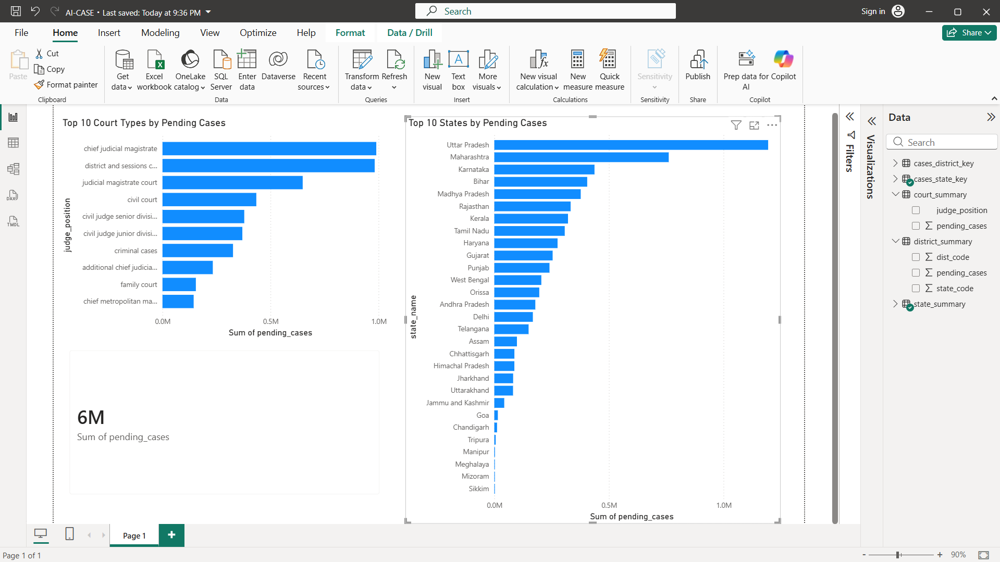
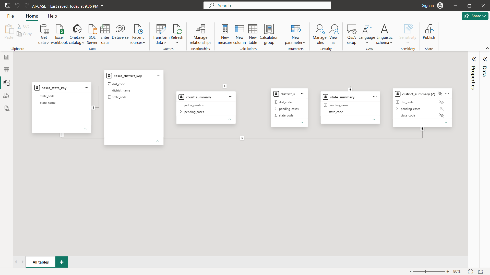

# AI-CASE: Judicial Analytics Dashboard

## Overview

AI-CASE is a data analytics project focused on analyzing judicial case backlog trends using Indian court case data. The project processes millions of court records and presents key insights through an interactive Power BI dashboard.

The objective is to identify regions and court types with the highest pending caseloads and demonstrate the use of Python and Power BI for large-scale data analysis.

---

## Dataset

* Source: Indian Court Case Records
* Year Analyzed: 2018
* Total Records Processed: 13.7+ Million
* Pending Cases Identified: 6.3+ Million

---

## Technologies Used

* Python
* Pandas
* Power BI
* CSV Data Processing
* Data Modeling
* Data Visualization

---

## Project Workflow

### 1. Data Cleaning & Preparation

* Processed raw judicial case records using Python.
* Handled missing values and date fields.
* Created summary datasets for dashboard reporting.

### 2. Data Modeling

* Built lookup tables for states and districts.
* Created relationships between summary and dimension tables.
* Structured the data for efficient reporting in Power BI.

### 3. Dashboard Development

Developed an interactive Power BI dashboard containing:

#### Key Metrics

* Total Pending Cases

#### Visualizations

* Top 10 States by Pending Cases
* Top 10 Court Types by Pending Cases

---

## Key Insights

* Over 6 million cases remained pending in the analyzed dataset.
* A small number of states contribute a significant share of the total backlog.
* Certain court categories handle substantially larger pending caseloads than others.

---

## Repository Structure

```text
AI-CASE-Judicial-Analytics-Dashboard/
│
├── dashboard_data.py
├── state_summary.csv
├── district_summary.csv
├── court_summary.csv
├── cases_state_key.csv
├── cases_district_key.csv
├── screenshots/
│   ├── dashboard.png
│   └── model_view.png
└── README.md
```

---

## Dashboard Preview

Add dashboard screenshots inside the `screenshots` folder and reference them here.

### Dashboard



### Data Model



---

## Skills Demonstrated

* Data Cleaning
* Exploratory Data Analysis (EDA)
* Data Transformation
* Data Modeling
* Business Intelligence
* Power BI Dashboarding
* Large Dataset Analysis
* Data Visualization

---

## Future Enhancements

* Multi-year trend analysis
* District-level drill-down analytics
* Predictive backlog forecasting
* AI-powered judicial query assistant
